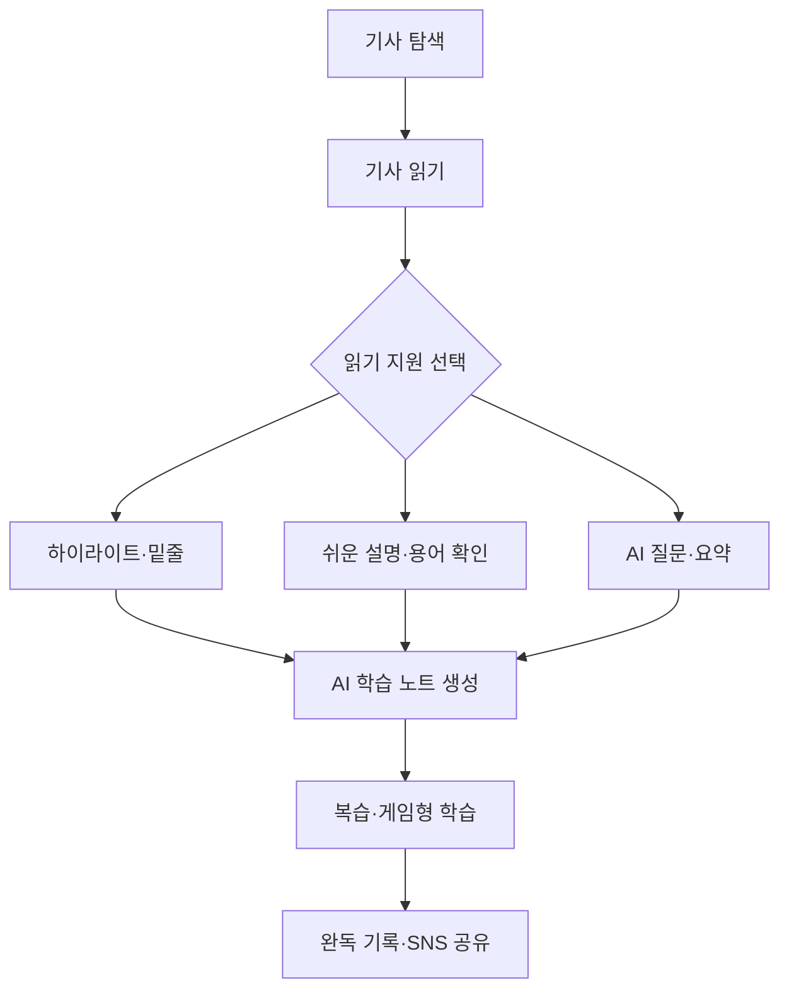

# Com4nent — AI 기반 경제 뉴스 학습 경험 개선

> 한경 프로젝트 기반 UXUI 디자인 실전 캠프 5기 팀 프로젝트 

한국경제의 신뢰도 높은 경제 콘텐츠를 모바일 환경에서도 깊이 읽고, 이해하고, 기록할 수 있도록 개선한 AI 기반 뉴스 학습 서비스입니다. 종이신문에서 밑줄을 긋고 메모하던 열독 경험을 디지털로 확장하고, 경제 뉴스 입문자에게는 쉬운 설명과 게임형 콘텐츠를 제공하여 경제 리터러시 향상을 돕습니다.

## 1. 프로젝트 개요

| 구분      | 내용                                   |
| :------ | :----------------------------------- |
| 프로젝트명   | AI 기반 경제 뉴스 학습 경험 개선                 |
| 수행 과정   | 한경 프로젝트 기반 UXUI 디자인 실전 캠프 5기         |
| 팀명      | Com4nent(컴포넌트)                       |
| 프로젝트 유형 | UX 리서치·서비스 기획·UI 디자인·프로토타이핑·프론트엔드 개발 |
| 대상 서비스  | 한국경제 디지털 뉴스 서비스                      |
| 핵심 분야   | AI, 저널리즘, 데이터 분석, UX/UI 디자인, 웹 서비스   |
| 우선 플랫폼  | 모바일 웹 기반, 향후 데스크탑앱 확장을 고려한 구조        |

## 2. 프로젝트 배경

뉴스 소비는 포털 검색 중심에서 SNS와 생성형 AI 중심으로 빠르게 이동하고 있습니다. 그러나 전통 경제신문의 디지털 경험은 지면의 디자인 퀄리티, 신뢰감과 정보 밀도를 충분히 살리지 못하면서도, 모바일 사용자가 원하는 쉬운 이해·개인화·상호작용을 제공하는 데 한계가 있었습니다.

Com4nent 팀은 보 과정에서 사용자 리서치, 경쟁 서비스 분석, GA4·Looker Studio 데이터 분석을 수행하고 다음 문제를 도출했습니다.

* 경제 용어와 높은 정보 밀도로 인해 입문 독자의 진입장벽이 높음
* 모바일에서는 종이신문처럼 밑줄을 긋고 메모하며 학습하기 어려움
* 기사를 읽은 뒤 핵심 내용을 다시 정리하거나 활용하기 위해 외부 서비스로 이동해야 함
* 읽기 경험이 일회성으로 끝나 완독, 복습, 재방문으로 이어지기 어려움
* SNS와 AI 서비스 중심의 새로운 콘텐츠 유입 경로에 대한 연결이 부족함

## 3. 문제 정의

> 신뢰도 높은 경제 뉴스를 모바일에서도 쉽게 이해하고 깊이 읽으며, 읽은 내용을 기록·복습·공유할 수 있는 경험이 필요합니다.

### 핵심 사용자

| 사용자 유형       | 현재 행동                      | 주요 어려움                         | 기회 영역                         |
| :----------- | :------------------------- | :----------------------------- | :---------------------------- |
| 정보 탐색·학습형 독자 | 기사에 밑줄을 긋고 메모하며 경제 정보를 학습함 | 모바일에서 열독 행위를 이어가기 어렵고 기록이 분산됨  | 하이라이트, AI 노트, 완독 기록, 복습 루틴 제공 |
| 경제 뉴스 입문자    | 신뢰도 높은 매체로 경제 공부를 시작하려 함   | 전문용어와 기사 문법이 어렵고 학습 동기가 쉽게 떨어짐 | 쉬운 기사, 용어 설명, 게임형 학습 경험 제공    |

## 4. 프로젝트 목표

1. 전통 경제신문의 신뢰감과 몰입감을 모바일 환경에 맞게 재해석함
2. 기사 안에서 읽기부터 이해, 기록, 복습까지 완료할 수 있도록 지원함
3. AI를 활용해 사용자가 선택한 핵심 내용을 요약하고 실행 가능한 노트로 전환함
4. 쉬운 설명과 게임형 콘텐츠를 통해 경제 뉴스 입문자의 진입장벽을 낮춤
5. 완독과 학습 기록의 공유를 통해 재방문과 새로운 독자 유입을 유도함

## 5. 핵심 솔루션

### 5.1 AI 요약 및 액션 아이템

사용자가 하이라이트한 문장을 AI가 자동으로 요약하고, 핵심 인사이트와 후속 확인 항목을 노트 형태로 정리합니다. 기사 밖으로 이동하지 않고도 읽기·이해·정리를 한 흐름에서 수행할 수 있습니다.

### 5.2 쉬운 기사와 경제 용어 설명

경제 뉴스 입문자를 위해 기사 난이도를 낮춘 설명, 핵심 용어 해설, 문단별 요약을 제공합니다. 원문의 의미와 신뢰성은 유지하면서 사용자의 배경지식에 맞는 읽기 경험을 지원합니다.

### 5.3 게임형 경제 학습

기사의 주요 개념과 데이터를 퀴즈, 예측, 미션 등 인터랙티브 콘텐츠로 변환합니다. 어려운 경제 개념을 가볍게 탐색하도록 돕고 학습 동기와 반복 참여를 높입니다.

### 5.4 학습 기록과 SNS 공유

하이라이트, 핵심 요약, 완독 기록을 공유용 카드로 자동 생성합니다. Threads, X, Instagram 등으로 학습 성과를 공유하여 개인의 학습 인증과 서비스의 자연스러운 확산을 연결합니다.

### **5.5 하이라이트·밑줄 인터랙션**

기사 본문을 드래그하여 종이신문처럼 형광펜 표시와 밑줄을 남길 수 있습니다. 사용자가 중요하다고 판단한 문장을 직접 선택하게 하여 수동적 읽기를 능동적 학습 경험으로 전환합니다.

### 5.6 학습 데이터 시각화

읽은 기사, 완독률, 관심 주제, 하이라이트 기록을 시각화하여 사용자가 자신의 경제 학습 흐름을 확인하고 지속적인 읽기 습관을 만들도록 지원합니다.

## 6. 사용자 경험 흐름



## 7. 주요 기술과 적용 영역

| 기술                           | 적용 영역                       |
| :--------------------------- | :-------------------------- |
| React, HTML, CSS, JavaScript | 모바일 웹 UI 및 인터랙션 구현          |
| LLM 기반 요약·RAG 챗봇             | 하이라이트 요약, 용어 설명, 기사 기반 질의응답 |
| 생성형 이미지                      | SNS 공유 카드와 게임형 콘텐츠 비주얼 제작   |
| 생성형 음성                       | 게임형 콘텐츠 및 접근성 지원용 음성 내레이션   |
| 데이터 시각화                      | 완독, 관심 주제, 학습 기록 시각화        |
| GA4, Google Tag Manager      | 사용자 행동 이벤트 설계 및 효과 측정       |
| Looker Studio                | 유입 경로와 콘텐츠 이용 데이터 분석        |
| Figma, Figma Make            | UX/UI 설계와 인터랙티브 프로토타이핑      |
| Claude Code, GitHub          | AI 지원 개발, 코드 및 문서 버전 관리     |
| GCP                          | 서비스 및 데이터 처리 환경 구성          |

## 8. 프로젝트 수행 과정

| 단계       | 주요 활동                                            | 주요 산출물               |
| :------- | :----------------------------------------------- | :------------------- |
| 1. 발견    | 경쟁 서비스 조사, 한국경제 서비스 분석, GA4·Looker Studio 데이터 분석 | 현황 분석, 문제 목록, 기회 영역  |
| 2. 정의    | 사용자 리서치, 페르소나, 사용자 여정, 핵심 가설 수립                  | 문제 정의, 사용자 유형, UX 전략 |
| 3. 아이데이션 | 하이라이트, AI 요약, 쉬운 기사, 게임형 학습 아이디어 구체화             | 기능 우선순위, 사용자 플로우     |
| 4. 설계    | 정보구조, 와이어프레임, 디자인 시스템, UI 화면 설계                  | Figma 프로토타입, UI 컴포넌트 |
| 5. 구현    | React 기반 모바일 웹과 AI 기능 PoC 개발                     | 작동형 프로토타입, 코드 저장소    |
| 6. 검증    | 사용자 테스트, 행동 데이터 확인, 피드백 반영                       | 테스트 결과, 개선안, 최종 결과물  |

## 9. 팀 구성 및 역할

| 이름  | 역할        | 담당                 |
| :-- | :-------- | :----------------- |
| 김민성 | 팀장·PM     | 일정과 우선순위 관리        |
| 김아영 | UX/UI 디자인 | 디자인 시스템과 UI 일관성 관리 |
| 윤다빈 | 개발        | 저장소 관리와 AI 기능 구현   |
| 이주희 | 미디어       | 발표자료와 시연 영상 제작     |

## 10. 기대 효과

| 관점     | 기대 효과                                |
| :----- | :----------------------------------- |
| 기존 독자  | 기사 체류시간, 완독률, 재방문율 향상 및 경제 학습 루틴 형성  |
| 입문 독자  | 전문용어와 정보 밀도에 대한 부담 완화, 경제·금융 리터러시 향상 |
| 콘텐츠 경험 | 읽기·이해·정리·복습을 기사 안에서 연결하는 완결형 경험 구축   |
| 서비스 확산 | 학습 기록 공유를 통한 SNS 기반 신규 유입 경로 확대      |
| 비즈니스   | AI 기능 이용과 반복 방문을 기반으로 구독 전환 가능성 강화   |
| 확장성    | 경제 뉴스에서 시사·교육 콘텐츠로 학습형 인터랙션 확장 가능    |

## 11. 성과 측정 지표

* 기사 완독률과 평균 체류시간
* 하이라이트·밑줄 기능 사용률
* AI 요약·용어 설명·질의응답 이용률
* 학습 노트 저장 및 재열람률
* 게임형 콘텐츠 참여율과 반복 이용률
* 공유 카드 생성 및 SNS 공유율
* 재방문율과 구독 전환율

## 12. 협업 방식

| 분류       | 채널         | 용도                    |
| :------- | :--------- | :-------------------- |
| 일반·긴급 연락 | 카카오톡 오픈채팅방 | 실시간 알림과 간단한 소통        |
| 프로젝트 작업  | Discord    | 화면 공유, 음성 회의, 자료 아카이빙 |
| 과정 공식 소통 | LMS 과정 채팅방 | 공식 안내와 기록 보존          |
| 일정·업무 관리 | Jira       | 스프린트, 담당 업무, 진행 상태 관리 |
| 코드·문서 관리 | GitHub     | 버전 관리, 이슈, 브랜치, PR 운영 |

* 의견 불일치 시 팀 논의를 우선하며, 필요하면 팀장 조율과 강사·멘토 피드백을 통해 결정합니다.
* 회의 내용은 AI 회의록 도구로 정리하고 `docs/meeting-notes/`에 기록합니다.

## 13. Git 저장소 구조

```text
docs/
  design/         # design.md — SSOT 리다이렉트 스텁 (실제 디자인 시스템은 Papertory/guidelines/design.md)
  meeting-notes/  # 회의록
  planning/       # 프로젝트 계획과 마일스톤
  deliverables/   # 스프린트별 산출물
    analysis/     # 시장·경쟁사·유입경로·사용자 리서치 분석
    poc/          # 기능별 PoC 프로토타입 및 정리 문서
    poc-phase2/   # 2차 PoC 프로토타입
    persona/      # AI 페르소나 FGI 챗봇 프로토타입
    ui/           # 와이어프레임·하이파이 목업 (Figma 링크)
    mvp/          # 최종 작동 MVP
    report/       # 결과보고서
CLAUDE.md         # AI 개발 지원용 프로젝트 컨텍스트
README.md         # 프로젝트 소개
```

## 14. 프로젝트 의의

이 프로젝트는 해커톤 참가를 위한 단기 아이디어가 아니라, 한경 프로젝트 기반 UXUI 디자인 실전 캠프 5기에서 수행한 리서치·기획·디자인·개발·검증의 결과물입니다. 전통 저널리즘의 신뢰성을 유지하면서 AI와 인터랙션을 활용해 경제 뉴스를 더 쉽게 이해하고, 깊이 읽고, 지속적으로 학습할 수 있는 사용자 경험을 제안합니다.

***

**Com4nent · 한경 프로젝트 기반 UXUI 디자인 실전 캠프 5기**
