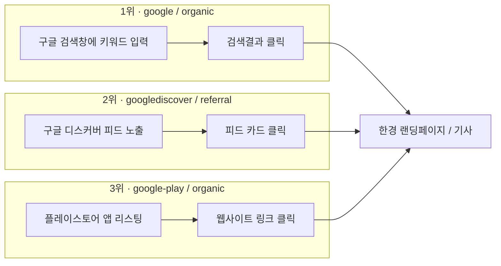

# 한국경제 채널별 유입경로 통합 분석 — 네이버 · 구글 · 유튜브 · LLM

네이버, 구글, 유튜브, LLM 검색/챗봇 조사 결과를 하나로 통합해, 채널 간 유입 메커니즘의 성격 차이와 공통 기회요소를 정리한 문서입니다.

**통합 대상 원본 문서**
- 네이버(웹/앱) 기반 한국경제 뉴스페이지 유입 경로 정리 문서
- entry-path-flow-analysis.md — 3. 구글(Google) 진입경로 분석
- 한경 유튜브 전략 분석: 기회요소 인사이트 및 가설 검증 설계
- 한국경제_AI검색_유저플로우.md (Claude / Chrome AI 모드 / ChatGPT / Gemini / Copilot)

---

## 0. 채널별 데이터 성격 차이 (주의사항)

네 채널의 데이터는 측정 기준·기간·단위가 서로 달라 절대값 비교보다 **구조적 패턴 비교**에 초점을 맞춰야 합니다.

| 채널 | 데이터 기간 | 측정 단위 | 데이터 출처 |
|---|---|---|---|
| 네이버 | 2026.6.6~7.5 (1개월) | 세션 소스/매체별 조회수 | GA4 |
| 구글 | 2026년 6~7월 | 세션 소스/매체별 조회수 (오피니언·아르떼 섹션) | GA4 |
| 유튜브 | 채널 누적 (2024.11~2026.7) | 구독자 수, 조회수 | 유튜브 스튜디오 + 업계 벤치마크(외부 인용) |
| LLM | 최근 1개월 | 세션 소스/매체(ai-assistant, referral) | GA4 |

---

## 1. 채널별 핵심 지표 한눈에 보기

| 채널 | 유입 성격 | 규모감 | 성장 방향성 |
|---|---|---|---|
| **네이버** | 목적형 검색(60%+) + PC 뉴스스탠드 고정 독자 | 오피니언 섹션 기준 최상위권 (naver/organic 5,536 등) | 정체·완만한 감소 예상 (강사 피드백: 네이버 뉴스 소비자 자체가 줄고 있음) |
| **구글** | 정석 검색(1위) + Discover 알고리즘 추천(2위) + Gemini 인용(신규) | google/organic이 오피니언·아르떼 전체 트래픽의 15.0%(8,611건)로 전 채널 통틀어 최대 단일 채널 | Discover·Gemini 등 비검색형 유입이 새로 부상 중 |
| **유튜브** | 구독 기반 습관적 시청 (라이브, 정기 세그먼트) | 7개 채널 합산 구독자 약 390만 명, 코리아마켓 1년 2개월 만에 +23만 순증 | 국내 유튜브 뉴스 이용률(49%)이 세계 평균(31%) 상회, 50대 이상 이용 급증(+9%p) — 구조적 성장기 |
| **LLM (AI 검색·챗봇)** | AI 답변 내 출처 인용을 통한 유입 | 5개 플랫폼 합산 227건(전체의 0.4% 미만) — 절대 규모는 가장 작음 | 아직 초기 단계지만 GEO 경쟁이 적어 선점 여지가 가장 큼 |

**핵심 요약**: 현재는 **네이버·구글이 규모를, 유튜브가 잠재 오디언스를, LLM이 미래 성장성을** 각각 대표하는 구조입니다.

---

## 2. 채널별 상세 분석

### 2.1 네이버

**유입 경로 Top 5 (세션 소스/매체)**

| 순위 | 세션 소스/매체 | 조회수 | 성격 |
|---|---|---|---|
| 1 | naver / organic | 5,536 | 통합검색 자연 유입 |
| 2 | m.search.naver.com / referral | 4,206 | 모바일 검색결과 유입 |
| 3 | newsstand.naver.com / referral | 2,990 | PC 뉴스스탠드 고정 독자 |
| 4 | naverapp / referral | 985 | 앱 내부 브라우저 |
| 5 | naver.com / referral | 561 | 기타 네이버 도메인 |

**핵심 인사이트**
- **목적형 검색의 절대 우위(약 62.1%)**: naver/organic + m.search.naver.com 합산 9,742회. 특정 필진·칼럼 제목·경제 키워드를 직접 검색해 찾아오는 비중이 압도적 → 콘텐츠 깊이와 SEO가 방어선.
- **PC 뉴스스탠드의 건재함**: 모바일 시대에도 2,990회로 3위. 직장인·비즈니스맨 중심 고정 독자층의 락인(Lock-in) 효과.
- **알고리즘 추천 지면의 한계**: media.naver.com/n.news.naver.com(647건 합산)은 하위권. 오피니언·칼럼은 정치/사회 속보 중심의 네이버 추천 피드에 걸리기 어려움.
- **UGC(블로그·카페)를 통한 2차 확산**: 158건 규모지만, 재테크 블로거·투자 카페에서 "신뢰성 있는 근거 자료"로 인용되는 지식 자산으로서의 가치를 보여줌.

**강사 피드백 (핵심 시사점)**
> 순위 3위 이하는 숫자가 작아 큰 의미 없음. 네이버 같은 플랫폼의 뉴스 소비자 수 자체는 줄고 있지만, 뉴스에 대한 관심·소비는 오히려 늘었을 수 있음. 자잘한 지면 최적화보다 **서비스 제공 방식 자체(포맷)**를 크게 재설계해야 함. 모바일 웹이지만 앱처럼 움직이는 방향을 권장.

또한 구글은 네이버 뉴스페이지를 거치지 않고 원문 기사로 바로 이동하며, ChatGPT는 RAG 형식으로 여러 뉴스를 인링크/아웃링크 혼재로 보여주는 반면 **Claude는 아웃링크 중심**이라는 관찰이 함께 기록됨 — 이는 아래 4장 LLM 분석과 정확히 일치합니다.

---

### 2.2 구글

**진입경로 순위 (source/medium)**

| 순위 | source/medium | 해석 |
|---|---|---|
| 1 | google / organic | 정석 검색결과 클릭 |
| 2 | googlediscover / referral | Discover 피드 알고리즘 추천 |
| 3~4 | google-play / organic | 플레이스토어 경유 |
| 7 | gemini.google.com / referral | Gemini 답변 내 링크 인용 |
| 10 | google / (not set) | 리퍼러 유실 (인앱브라우저·Discover 등) |
| 11 | trends.google.co.kr / referral | 트렌드 페이지 경유 |

**기기 분석 — 모바일 웹 우세**
오피니언·아르떼(66.9% 모바일), 글로벌마켓(64.2% 모바일) 모두 네이티브 앱보다 **모바일 웹(브라우저)** 유입이 압도적. 글로벌마켓은 앱 비중이 15%도 안 됨.

**기회요소**
1. Google Discover 최적화 — 키워드 경쟁이 아닌 썸네일·제목·이미지·구조화 데이터로 성과를 낼 수 있는 즉각적 채널.
2. Gemini(AI 인용) 채널 선점 — 볼륨은 작지만 경쟁이 적어 선점 효과 기대.
3. 모바일 웹 최적화 — 네이티브 앱이 아닌 모바일 웹 랜딩페이지(로딩 속도, 반응형, 음성검색 스니펫)에 투자 집중.

---

### 2.3 유튜브

**기존 트래픽 풀 (7개 채널 합산 구독자 약 390만)**

| 채널 | 구독자 | 습관적 접점 |
|---|---|---|
| 한국경제TV | 138만 | 실시간 증시 중계 상시 시청 |
| 한경 글로벌마켓 | 76만 | 오전 6시반대 라이브(월스트리트나우) |
| 한경 코리아마켓 | 73.1만 | 출퇴근 시간대 하루 2회 라이브(모닝루틴) — 1년 2개월 만에 +23만 순증 |
| 집코노미 | 62.7만 | 흥청망청·집터뷰 등 정기 세그먼트 |
| 한국경제TV뉴스 | 22.2만 | 속보 브리핑 |
| 한경arteTV | 11.6만 | 문화예술 콘텐츠 (투자와 무관, 교차유입 설계 없음) |
| 한국경제신문 | 5.96만 | 심층 분석(송종현의 머니톡 등) |

**핵심 인사이트**
- **구조적 타이밍 기회**: 한국은 유튜브 뉴스 이용률(49%)이 세계 평균(31%)을 크게 상회하는 이례적 시장. 지면 축소(-5.0%)와 디지털 성장(+4.9%)이 교차하는 시점.
- **연령 역설**: 2030세대는 틱톡·인스타로 이탈 중이나, 50대 이상 유튜브 이용률은 오히려 +9%p 증가 — 한경의 전통 핵심 독자층과 정확히 겹침.
- **퍼스널리티 IP화**: 18~24세는 브랜드(39%)보다 개별 기자(51%)에 더 반응. 한경은 이미 월스트리트나우(김현석)·글로벌마켓나우(조재길)·한상춘의 국제경제 등 진행자 개인 브랜드를 다수 보유.
- **프리미엄9 무료 티저 구조 실증**: 월 1회 무료 공개 영상이 수십만 조회수 기록. 라이브(무료)→다시보기(유료) 구조가 실제로 작동 중(희소성/손실회피 설계).
- **이탈 지점**: 인앱 브라우저 로딩 지연, 페이월/로그인 팝업의 노출 타이밍이 주요 이탈 요인.

**목표 재정의**: 유튜브 구독자를 늘리는 것이 아니라, **이미 확보된 390만 구독자 풀을 웹/앱으로 전환**하는 UX/UI 설계 문제로 좁혀서 접근.

**전환 트리거 지점 (터치포인트별 개선 방향)**
- 인앱 브라우저 랜딩: 3초 내 핵심 정보 노출 + 페이월 팝업은 일부 소비 후 노출(즉시 노출 시 반발/이탈 유발 — Reactance Theory)
- 고정 댓글/설명란: 단순 URL 나열이 아닌 "원본 데이터 보기"류 구체적 CTA로 전환
- 최종화면(End Screen)·카드: 영상 주제와 1:1 매칭되는 기사로 연결
- 진행자 비주얼 일관성: 영상 속 진행자 얼굴·이름을 랜딩 기사에도 동일 노출(신뢰 전이 효과)
- 앱 딥링크: 설치 유도보다 모바일 웹 우선 노출 후 설치 제안

**GEO(생성엔진최적화) 기회**: ChatGPT·Perplexity 등 AI 검색엔진이 새 유입 관문으로 부상 중이나, 국내 언론사 다수가 아직 스키마 마크업 등 기술 대응을 안 한 상태 — 경쟁이 적은 블루오션.

---

### 2.4 LLM (AI 검색·챗봇)

**플랫폼별 관찰 및 실측 데이터 요약**

| 플랫폼 | 출처 표시 | 필요한 사용자 행동 | 한국경제 도달 | 실측 유입(1개월) |
|---|---|---|---|---|
| Claude | 표시함(키워드별 노출 확률 상이) | 없음(노출 시 클릭만) | 조건부 가능 | 7건 (0.012%) |
| Chrome AI 모드 | 브랜드명 검색 시에만 상단 노출 | 정확한 키워드 입력 + 클릭 | 조건부 가능 | 분리 불가(google/organic 8,611건에 혼재) |
| ChatGPT | 표시되나 숨겨짐 | 소스 아이콘 클릭 + 스크롤 | 조건부 가능 | 185건 (0.323%) — 5개 중 1위 |
| Gemini | 없음 | 없음 | 불가 | 35건 (0.061%) — 테스트 결과보다 실제 유입 많음 |
| Microsoft Edge (Copilot) | 없음(구글 뉴스 위주) | 없음 | 불가 | 1건 (0.002%) |

**핵심 인사이트**
- 정성적 테스트(도달 난이도)와 정량 데이터(실제 유입량) 순위가 완전히 일치하지 않음. 특히 Gemini는 테스트상 "도달 불가"였지만 실제로는 Claude보다 5배 많은 유입 발생 — Google 검색 색인 품질에 따라 예외적으로 노출되는 구간이 존재함을 시사.
- ChatGPT는 클릭+스크롤이라는 허들에도 불구하고 절대 유입량 1위 — 경로 자체는 열려 있고 노출 위치 개선의 문제.
- Copilot과 Chrome AI 모드는 정성·정량 분석이 방향성 면에서 일치(거의 도달 불가/구분 불가).

전체 채널 대비 LLM의 절대 볼륨은 미미하지만(전체의 0.4% 미만), 유튜브 분석의 "GEO 블루오션" 인사이트와 정확히 맞물리는 지점입니다.

---

## 3. 채널 간 비교 분석

### 3.1 유입 메커니즘 성격 비교

| 구분 | 네이버 | 구글 | 유튜브 | LLM |
|---|---|---|---|---|
| 핵심 동인 | 목적형 검색 + 고정 지면 습관 | 검색 + 알고리즘 추천(Discover) | 구독 기반 습관적 시청 | AI 답변 내 출처 인용 |
| 유저의 능동성 | 중간(키워드 검색) | 낮음(Discover는 수동 피드) | 낮음(루틴화된 소비) | 낮음~중간(클릭/스크롤 필요) |
| 콘텐츠 발견 방식 | 검색엔진 인덱스 | 검색엔진 + 추천 알고리즘 | 채널 구독·편성 루틴 | LLM의 웹 검색/색인 참조 |
| 최적화 레버 | SEO, 콘텐츠 깊이 | SEO + Discover 최적화(썸네일 등) | 콘텐츠 편성 + 전환 UX | GEO(구조화 데이터, 크롤러 허용) |
| 현재 규모 | 큼 | 가장 큼(단일 채널 기준) | 잠재 오디언스 최대(390만 구독자) | 가장 작음 |
| 성장 방향 | 정체·완만한 감소 | Discover·Gemini 등 신규 채널 부상 | 구조적 성장기(뉴스 소비 이동) | 초기 단계, 경쟁 적음 |

### 3.2 공통적으로 발견되는 병목

1. **"뉴스 지면 추천"의 한계**: 네이버(media.naver.com), 유튜브(오피니언·문화 콘텐츠) 모두 일반 알고리즘 추천 피드에는 무거운 오피니언·칼럼 콘텐츠가 걸리기 어렵다는 공통 한계 확인.
2. **랜딩 후 이탈 지점의 유사성**: 유튜브 인앱 브라우저의 로딩 지연·페이월 팝업 이슈는, LLM 채널에서 관찰된 "클릭 이후 실제 도달까지의 허들"(ChatGPT 스크롤 등)과 본질적으로 같은 문제 — **원본 페이지 도달 이후의 첫 화면 경험**이 전환율을 좌우.
3. **브랜드 표기 민감도**: 네이버·구글은 필진명·칼럼 제목 등 구체적 키워드에 반응하는 반면, Chrome AI 모드는 "한국경제뉴스"라는 정확한 브랜드명에만 반응 — 채널을 막론하고 **브랜드 엔터티(다양한 표기의 동일 개체 인식)** 정비가 공통 필요.
4. **AI 기반 채널의 구조적 유사성**: Gemini(구글 생태계)·Chrome AI 모드·Copilot(Bing 생태계) 모두 결국 각 사의 검색 인덱스 품질에 종속됨 — 즉 LLM 최적화는 결국 전통적 SEO(구글) 및 Bing SEO의 연장선.

### 3.3 채널별 우선순위 판단 근거

- **네이버**: 이미 성숙한 채널로 자잘한 지면 최적화의 한계 도달 → 포맷 자체의 재설계(모바일 웹의 앱化) 필요.
- **구글**: 검색은 이미 강하나, Discover·Gemini 등 비검색형 신규 채널이 상대적으로 저비용 고효율 기회.
- **유튜브**: 신규 콘텐츠 제작보다 **이미 존재하는 약 390만 구독자( 한국경제에서 운영하는 유튜브 7개 채널 합산 ) 트래픽의 전환 설계**가 가장 저비용·고효율. 습관적 시청 루틴이 이미 존재하므로 전환 트리거만 삽입하면 되는 구조.
- **LLM**: 절대 볼륨은 작지만 경쟁자 다수가 아직 대응하지 않은 초기 시장 — 지금 선점 시 향후 AI 검색 비중 확대에 따른 복리 효과 기대.

---

## 4. 통합 기회요소 (Cross-Channel Opportunity Factors)

### 4.1 유입경로 단계별 기회요소

1단계 — 발견(Discovery): "애초에 노출되는가"

GEO/AIEO 조기 대응: AI 크롤러 허용, 구조화 데이터 정비를 통해 AI 검색·챗봇 결과에 콘텐츠가 노출될 확률 자체를 높이는 조치
브랜드 엔터티 통합 관리: 표기 변형(한국경제/한경/hankyung)을 하나의 개체로 인식시켜, 검색·AI가 콘텐츠를 매체와 연결지어 발견하도록 하는 조치

2단계 — 클릭유도(Click-through): "노출은 됐는데 클릭으로 이어지는가"

퍼스널리티(개인 브랜드) 자산 재활용: 유튜브에서 형성된 진행자 신뢰를 랜딩 기사·AI 인용 지점에도 노출시켜, 발견된 콘텐츠를 실제 클릭으로 전환시키는 신뢰 신호로 활용

3단계 — 랜딩유지(Retention): "클릭 이후 이탈 없이 소비로 이어지는가"

랜딩 후 첫 화면 UX 개선: 로딩 지연 해소 및 팝업 노출 시점 조정으로, 클릭 직후의 이탈을 방지
모바일 웹 우선 설계: 실제 유입의 대다수를 차지하는 모바일 웹 환경의 속도·레이아웃을 우선 최적화하여 랜딩 단계 이탈률을 낮추는 조치

전 단계 공통 기반(Cross-stage Infrastructure)

측정 체계 정비: 위 세 단계 각각의 개선 효과를 정확히 검증하기 위한 선행 조건으로, 채널별 UTM 표준화를 통해 어느 단계에서 성과가 발생했는지 구분 추적할 수 있어야 함

### 4.2 채널별 개별 기회요소 요약

| 채널 | 우선 기회요소 |
|---|---|
| 네이버 | 지면 최적화보다 서비스 포맷 재설계(모바일 웹의 앱化), MY뉴스·경제 테마판 노출을 위한 체류시간 증대 UI |
| 구글 | Google Discover 최적화(썸네일·구조화 데이터), 모바일 웹 랜딩페이지 속도 개선 |
| 유튜브 | 고정 댓글 CTA 구체화(즉시 실행 가능), 인앱 브라우저 랜딩 경량화, 페이월 팝업 타이밍 조정, 최종화면·카드 매칭 |
| LLM | AI 크롤러 허용 점검, 구조화 데이터/llms.txt 도입, Bing·MSN 파트너십(Copilot 대응), Gemini용 Google 색인 품질 개선 |

---

## 5. 병목현상 심층진단 — 왜 랜딩페이지·기사 도달이 어려운가

유저가 한국경제 기사/랜딩페이지에 도달하는 과정을 3단계로 나누면, 어느 채널이 어느 단계에서 막히는지가 뚜렷하게 드러납니다.

- **1단계 발견(Discovery)**: 애초에 한국경제 콘텐츠가 검색결과·추천피드·AI 답변에 노출되는가
- **2단계 클릭유도(Click-through)**: 노출은 됐지만 유저가 실제로 클릭하도록 설계되어 있는가
- **3단계 랜딩유지(Retention)**: 클릭 이후 페이지에 도달했을 때 이탈하지 않고 콘텐츠를 소비하는가

채널별로 병목이 발생하는 단계와 원인, 그리고 그에 맞는 해결 노력을 정리합니다.

### 5.1 네이버 — 주로 1단계(발견) 병목

**특징**: 목적형 검색(naver/organic, m.search.naver.com)은 이미 강하지만, 알고리즘 추천 지면(media.naver.com, MY뉴스)에는 오피니언·칼럼이 거의 노출되지 않음.

**병목 원인**
- 네이버의 뉴스 추천 알고리즘이 정치·사회 속보 중심으로 설계되어 있어, 무거운 오피니언 콘텐츠는 클릭률(CTR) 신호 자체가 약하게 잡히고 이는 다시 추천 우선순위 하락으로 이어지는 악순환.
- PC 뉴스스탠드는 "이미 한경을 구독한 독자"에게만 작동하는 폐쇄형 구조라, 신규 발견 경로로서는 기능하지 않음.
- 검색으로 들어오더라도 네이버 뉴스판(인링크) 안에서 소비가 끝나는 경우, 원문 사이트(한경 도메인)로의 아웃링크 전환이 별도로 발생하지 않음 — 이는 "도달"의 정의가 네이버 뉴스판인지 한경 자체 도메인인지에 따라 체감 성과가 달라지는 구조적 문제.

**해결 노력**
- 오피니언·칼럼 콘텐츠의 초반 체류시간(스크롤 depth, 완독률)을 늘리는 도입부 설계 → 알고리즘 신호 개선
- MY뉴스·경제 테마판向 콘텐츠는 제목·썸네일을 스트레이트 뉴스처럼 후킹력 있게 재구성해 추천 피드 진입 시도
- 인링크 소비 후 "한경 앱/사이트에서 이어보기" 등 원문 전환 CTA를 뉴스판 내 요소로 삽입

### 5.2 구글 — 2단계(클릭유도)·3단계(랜딩유지) 병목이 상대적으로 큼

**특징**: 구글은 검색결과 클릭 시 네이버처럼 자사 뉴스판을 거치지 않고 원문 페이지로 바로 이동한다는 점에서 구조적으로 유리함. 병목은 오히려 그 이후 단계에 있음.

**병목 원인**
- Discover 피드는 텍스트 검색이 아니라 썸네일·제목만으로 클릭 여부가 결정되는 채널인데, 뉴스 콘텐츠가 스트레이트 기사 포맷(썸네일 최적화 없음)으로 발행되면 노출은 되어도 클릭으로 이어지지 않음(2단계 병목).
- 모바일 웹 유입이 압도적(66.9%)인데도 랜딩페이지가 데스크톱 중심으로 설계되어 있다면 로딩 지연·레이아웃 깨짐으로 3단계에서 이탈.
- google/(not set), accounts.google.com 리다이렉트 등 노이즈성 트래픽이 섞여 있어, 실제 유효 발견 경로와 로그인/인증성 트래픽을 구분하지 못하면 개선 우선순위 판단 자체가 왜곡됨.

**해결 노력**
- Discover 전용 고해상도 썸네일(최소 1200px 권장 규격) 및 후킹력 있는 제목 A/B 테스트
- 모바일 웹 랜딩페이지 Core Web Vitals(로딩 속도, 레이아웃 안정성) 우선 점검
- GA4 세션 소스 필터링 규칙 정비로 인증성 트래픽과 콘텐츠 발견 트래픽을 분리 집계

### 5.3 유튜브 — 1단계는 이미 해결됨, 2·3단계 병목이 핵심

**특징**: 390만 구독자라는 발견(1단계) 자체는 이미 충분히 확보되어 있음. 문제는 "영상을 보는 것"에서 "기사를 읽는 것"으로 넘어가는 2·3단계.

**병목 원인**
- 고정 댓글/설명란의 링크가 단순 URL 나열에 그쳐, 유저가 클릭할 동기(가치 제안)를 느끼지 못함(2단계).
- 인앱 브라우저는 일반 모바일 브라우저보다 로딩이 느리고, 이 환경에서 진입 즉시 페이월·로그인 팝업이 뜨면 유저는 "차단당했다"고 느껴 반발성 이탈(Reactance Theory) — 3단계 병목의 핵심 원인.
- 영상 속 진행자(김현석, 전형진 등)와 랜딩된 기사 페이지 사이에 시각적 연속성이 없어, "방금 보던 사람이 쓴 글"이라는 신뢰 전이가 끊기며 체류 없이 이탈.
- 앱 미설치 유저에게 곧바로 설치를 강요하면 그 자체가 이탈 트리거가 됨.

**해결 노력**
- 고정 댓글 CTA를 "이 종목분석 원문 데이터 보기"처럼 구체적 가치 제안형 문구로 전환
- 인앱 브라우저 전용 초경량 랜딩 템플릿(3초 내 핵심 정보 노출) 별도 설계
- 페이월/로그인 팝업은 콘텐츠 일부 소비 후 노출되도록 타이밍 조정
- 진행자 얼굴·이름을 랜딩 기사에도 동일하게 노출해 시각적 신뢰 연속성 확보
- 앱 딥링크는 설치 유도보다 모바일 웹 우선 노출 후 설치 제안 순서로 변경

### 5.4 LLM — 플랫폼별로 병목 발생 단계가 다름

LLM은 5개 플랫폼이 저마다 다른 단계에서 막히기 때문에, 공통 진단이 아니라 플랫폼별 진단이 필요합니다.

| 플랫폼 | 병목 단계 | 근본 원인 |
|---|---|---|
| Claude | 1단계(발견) | 자체 웹 검색 결과에 한국경제가 상위 노출되는지가 키워드마다 불안정 — 크롤러 접근 허용 여부, 구조화 데이터 부재, 색인 신선도(freshness) 신호 부족 추정 |
| ChatGPT | 2단계(클릭유도) | 발견 자체는 되지만(1위 유입량) 출처가 접힌 UI 구조 뒤에 있어 클릭까지 추가 행동(스크롤)이 필요 — 이는 매체가 통제 불가능한 플랫폼 UI 설계이므로, 대신 "상위 인용"이라도 되도록 authoritativeness(권위) 신호 강화가 대안 |
| Gemini | 1단계(발견) | 출처 표기 자체를 최소화하는 Google AI Overviews의 정책적 설계(제로클릭 지향) — 매체 노력만으로 해결하기 어려운 플랫폼 구조적 요인이 크고, 구글 자체 색인 품질 개선이 간접적 레버 |
| Microsoft Edge (Copilot) | 1단계(발견) | Bing 색인 자체에 한국경제 콘텐츠에 대한 SEO 대응이 충분치 않을 가능성 — Bing 웹마스터 도구 미등록, MSN 파트너 네트워크 미편입 추정 |
| Chrome AI 모드 | 1단계(발견) | 브랜드 엔터티 인식이 "한국경제뉴스"라는 정확한 표기에만 반응 — "한국경제", "한경" 등 변형 표기가 동일 개체로 연결되지 않는 지식그래프 정비 미비 |

**공통 해결 노력**
- AI 크롤러(GPTBot, ClaudeBot, Google-Extended, Bingbot) 허용 여부 전수 점검 — 차단 시 1단계 자체가 원천 불가능
- NewsArticle/Organization/Author 구조화 데이터 적용으로 발견 확률과 권위 신호 동시 강화
- llms.txt 등 AI 전용 참조 파일 도입 파일럿
- Bing 웹마스터 도구 등록 및 MSN 파트너 네트워크 편입 검토(Copilot 대응)
- 브랜드 표기 변형(한국경제/한경/hankyung 등)을 하나의 엔터티로 묶는 지식그래프·Sameas 마크업 정비

### 5.5 단계별 종합 진단

| 단계 | 병목이 큰 채널 | 병목이 작은 채널 |
|---|---|---|
| 1단계(발견) | 네이버(추천피드), Gemini, Copilot, Chrome AI 모드, Claude | 구글 검색, ChatGPT |
| 2단계(클릭유도) | 유튜브(고정댓글), ChatGPT(접힌 UI) | 네이버 검색, 구글 검색 |
| 3단계(랜딩유지) | 유튜브(인앱브라우저), 구글(모바일 웹 미최적화 가정 시) | - |

이 매핑이 시사하는 바는, **"어느 채널을 개선할 것인가"보다 "어느 단계를 개선할 것인가"로 문제를 재정의**해야 자원을 효율적으로 배분할 수 있다는 점입니다. 예를 들어 구조화 데이터·크롤러 허용 같은 1단계 개선은 네이버 추천피드·모든 LLM 플랫폼에 동시에 영향을 주는 반면, 페이월 타이밍 조정 같은 3단계 개선은 유튜브 경유 트래픽에 국한된 효과를 냅니다.

---

## 6. 우선순위 제언 종합

**즉시 실행 가능 (Quick Win, 별도 콘텐츠 제작 불요)**
- 유튜브 고정 댓글/설명란 CTA 문구 개선
- 로봇 크롤러(robots.txt) 허용 여부 점검 — 전 채널 공통, 리소스 소모 없이 확인 가능
- 페이월/로그인 팝업 노출 타이밍 조정 A/B 테스트

**중기 과제 (기존 자산 확장)**
- 유튜브 최종화면·카드 매칭, 진행자 비주얼 일관성 UI
- Google Discover용 썸네일·구조화 데이터 정비
- 브랜드 엔터티 통합(지식그래프 정비)

**탐색적 파일럿 (국내 사례 적음, 소규모 실행 후 확장)**
- GEO 마크업 적용 후 AI 검색엔진 인용 빈도 비교 실험
- llms.txt 도입 테스트
- 숏폼 자동화 제작 장치(강사 제언: 대응 이미지 생성 + 음성 지원 자동화)

**측정 선행 조건**
- 모든 가설 검증과 우선순위 재조정의 전제는 GA4/UTM 데이터의 정합성 확보. 특히 Chrome AI 모드처럼 아직 구분되지 않는 유입을 분리 측정할 수 있는 태깅 체계 정비가 다른 모든 개선의 선행 과제.

