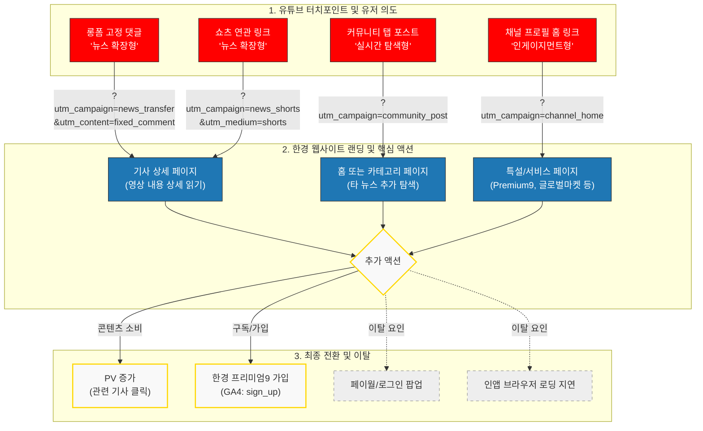

# 한국경제 유튜브 채널 유입 분석 및 유저 플로우 시각화 보고서

> 최종 업데이트: 2026-07-06

---

## 1. 보고서 배경 및 목적: 디지털 전환의 '골든타임'과 전략적 결단

2026년 글로벌 언론 산업, 지면 시장의 가파른 축소(-5.0%)와 디지털의 견조한 성장(+4.9%)이라는 구조적 전환의 임계점 도달. 한국은 디지털 뉴스 시장 성장률 +7.3%로 인도(+11.3%)에 이어 전 세계 2위 성장세 기록.

본 보고서, 한국경제(한경)가 직면한 이 '골든타임' 선점을 위한 유튜브 전략 제안. 포털 의존형 수익 구조 탈피, 유튜브를 강력한 유입 거점으로 활용한 독자적 뉴스 브랜드 생태계 구축이 핵심 목적. 단순 트래픽 확보를 넘어 한경 저널리즘 가치를 수익화 가능한 '데이터 자산'으로 전환하는 전략적 브리핑.

## 2. 국내 디지털 뉴스 지형 및 유튜브 이용 현황 분석

- **유튜브 압도적 점유율**: 국내 뉴스 영상 소비 플랫폼 중 유튜브(53%) 독보적 1위
- **뉴스 소비 패러다임 변화**: 한국 시장 유튜브 뉴스 이용률(49%), 세계 평균(31%)보다 압도적으로 높음. 검색 기반 '탐색형 구조'에서 알고리즘 기반 '노출형 구조'로 재편 중
- **플랫폼 다변화와 연령별 격차**: 20~30대는 틱톡·인스타그램으로 급속 이탈, 50대 이상 유튜브 이용률 전년 대비 +9%p 증가하며 핵심 오디언스로 안착
- **직접 유입의 위기**: 한국 언론사 웹사이트 직접 방문 비율 단 6%, 조사 대상 48개국 중 47위. 플랫폼 종속으로 독자 접점 상실 상태, 유튜브발 웹 유입 전환 전략이 생존 필수 과제

## 3. 한경 유튜브 채널 상세 지표 및 경제적 가치 벤치마킹

### 3-1. 채널별 최신 구독자 지표 (2026년 7월 기준)

| 채널명 | 구독자 수 (최신) | 핵심 타깃 | 대표 프로그램 |
|---|---|---|---|
| 한국경제TV | **138만 명** | 대중적 투자자, 실시간 증시 시청층 | 실시간 증시 중계, 전문가 시장 진단 및 종목 분석 |
| 한경 글로벌마켓 | **76만 명** | 해외 주식 전문·고관여 투자자 | 월스트리트나우(김현석), 글로벌마켓나우(조재길), 실리콘밸리나우(황정수), 돈버는 퇴근길 |
| 한경 코리아마켓 | **73.1만 명** (2026.07 현재) | 국내 증시 밀착형 투자자 | 출퇴근 시간대 하루 2회 라이브 방송, '모닝루틴', '딥코노미' 세그먼트 ([채널 링크](https://www.youtube.com/@hk_koreamarket)) |
| 집코노미 | **62.7만 명** | 국내 부동산 실수요·투자자 | 흥청망청(청약), 집터뷰(전문가 인터뷰), 3분부동산(애니메이션), 발품리포트 |
| 한국경제TV뉴스 | **22.2만 명** | 실시간 속보·경제뉴스 소비층 | 주요 경제 뉴스 브리핑, 현장 리포트 |
| 한경arteTV | **11.6만 명** | 문화예술 애호가·고급 라이프스타일 소비층 | 클래식·오페라·발레·미술 등 종합문화예술 콘텐츠 ([채널 링크](https://www.youtube.com/@hankyungartetv)) |
| 한국경제신문 | **5.96만 명** | 심층 분석·통찰 추구형 신문 독자 | 송종현의 머니톡, 임락근의 식스센스, 한상춘의 국제경제 분석 |

> 참고: '주코노미TV'는 국내 증시·MZ 투자자 타깃 채널로 논의되었으나, 위 최신 구독자 수 확인 목록에는 별도 채널로 포함되지 않음. 실제로는 한경 글로벌마켓/한국경제TV 내 세그먼트 프로그램일 가능성이 있어 정확한 채널 여부는 별도 확인 필요.

### 3-2. 한경 코리아마켓 상세

- **채널 성격**: 한국경제신문 기자들이 직접 제작하는 국내 증시 밀착형 경제 콘텐츠 채널 (핸들: [@hk_koreamarket](https://www.youtube.com/@hk_koreamarket))
- **구독자 성장 추이**: 2024년 11월 말 40만 명 돌파 → 2025년 6월 8일 기준 50만 명 돌파(약 50.2만 명) → 2026년 7월 현재 **73.1만 명**, 약 1년 2개월 만에 23만 명 이상 추가 증가
- **핵심 콘텐츠**: 출퇴근 시간대 하루 2회 편성되는 라이브 방송이 고속 성장의 핵심 축, '모닝루틴'(출근길 브리핑)·'딥코노미' 등 심층 경제 콘텐츠 세그먼트 운영
- **전략적 의미**: 국내 주식시장 흐름과 종목 정보를 즉각 필요로 하는 투자자층 공략, '한경 프리미엄9' 등 유료 서비스 가입 전환 의사가 높은 진성 유저 다수 포진

### 3-3. 한경arteTV 상세

- **채널 성격**: 국내 최초 종합문화예술 방송 채널. 2022년 12월 1일 개국, 한경이 케이블 채널 '아르떼TV' 인수해 운영
- **도달 기반**: KT·SK브로드밴드·LG유플러스 IPTV 3사가 기본채널로 편성, 유료방송 접점 가구 수 1,600만 → 3,000만 가구로 확대
- **콘텐츠 축**: 음악(클래식·오페라)·미술·발레·뮤지컬·문학 등 고품격 문화예술 전반. 웹 플랫폼 arte.co.kr(뮤직/아트/스테이지·씨네/북 4개 카테고리)과 콘텐츠 연계
- **전략적 의미**: 투자정보 중심(집코노미, 글로벌마켓 등) 채널군과 달리 문화·라이프스타일 관심층을 유입시키는 채널군. 한경 브랜드의 '경제지'를 넘어선 프리미엄 라이프스타일 미디어로서의 포지셔닝 확장 근거로 활용 가능

### 3-4. 성장 히스토리 근거 (출처·기간 명시)

| 구분 | 집코노미TV | 한경 글로벌마켓 |
|---|---|---|
| 채널 개설 시점 | 2018년 11월 | - (성장 가속기 2021~2022년) |
| 월평균 조회수 | 100만 회 (개설 1년 시점 기준) | - |
| 일평균 조회수 (역산) | 약 3.3만 회 (100만 회 ÷ 30일) | - |
| 구독자 11만 돌파 | 2020년 2월 (개설 1년 3개월 시점) | - |
| 구독자 30만 돌파 | 2022년 4월 2일 | 2022년 4월 11일 (언론사 재테크 채널 중 최초) |
| 누적 시청 시간 (2020.2 기준) | 101만 시간, 1인당 평균 4분 29초 | - |
| 개별 영상 성과 | '집터뷰'(김영익 교수) 1개월 만에 70만 뷰 / '전세자금대출' 누적 58만 뷰 / '위례 상가' 32만 뷰 | - |

- 구독자 규모 기준 2022년 대비 현재(2026년 7월) 집코노미 62.7만 명·글로벌마켓 76만 명으로 약 2배 이상 성장, 월 잠재 유입 규모도 비례 확대된 것으로 추정
- 한경 코리아마켓은 2024년 11월 40만 → 2025년 6월 50.2만 → 2026년 7월 73.1만 명으로, 최근 1년여간 가장 가파른 성장세를 보이는 채널
- **글로벌 벤치마크**: 100만 구독자 이상 영어권 뉴스 채널 평균 성장률 16% (Press Gazette, 118개 매체 기준) — 한경 목표 성장률의 참고 지표

### 3-5. 조회수-유입 상관관계 근거 사례

- 금융 분야 팟캐스트/유튜브 마케팅 사례: 조회수 1,600% 급증 시 웹사이트 추천(Referral) 트래픽 204% 증가
- 커뮤니티 탭 활성 채널: 비활성 채널 대비 구독자 대비 조회수 비율 평균 2.3배 높음
- 영상 시청 시 메시지 보유율 95% (텍스트 10%) — 브랜드 재방문·직접 URL 입력 방문 가능성 제고 요인

### 3-6. 타사 매체 벤치마킹

| 매체 | 전략 |
|---|---|
| 뉴욕타임스(NYT) | 팟캐스트('The Ezra Klein Show')를 비디오 포맷 재구성, 자사 앱 내 비디오 탭 개설해 유튜브 시청자를 인앱 경험으로 전환 |
| AJ+ (알자지라) | 젊은 층 공략 위한 숏폼 중심 시각적 영상 |
| 도이체벨레(DW) | 짧은 클립 + 긴 다큐멘터리 병행하는 멀티 포맷, 노출 빈도와 체류시간 동시 확보 |
| Liputan6 SCTV(인도네시아) | 속도·시각화·SEO·CTA 등 9대 전략으로 웹사이트 전환 |
| Luzu TV(아르헨티나)·Kanal Zero(폴란드) | 유튜브 네이티브 뉴스-엔터테인먼트 혼합 콘텐츠로 대규모 구독자 확보, 기성 매체 위협 |
| 국내 방송사 | MBCNEWS 1위, SBS·JTBC 뒤이음. SBS '스브스뉴스' 등 버티컬 서브 브랜드로 MZ 타깃 유입 |

- 숏폼: 2025년 기준 수직형 비디오 시청 완료율, 수평형 대비 90% 높음 — 채널 홈·롱폼 유도 퍼널 역할
- 퍼스널리티 중심 전략: 18~24세 유저, 뉴스 브랜드보다 기자·크리에이터 개인에 더 높은 관심(51% vs 39%) — 워싱턴포스트 사례처럼 스타 기자 전면 배치 유효

## 4. 데이터 기반 타깃 페르소나 심층 분석

### 4-1. 거시 페르소나 (정치성향·기술수용도 기반)

- **페르소나 1 (Active Silver)**: 유튜브 뉴스 소비 50~60대 보수 성향 유저. 온라인 허위정보 우려 74%(진보 성향 40% 대비 압도적, <미디어서베이 11권 3호> 근거). '신뢰할 수 있는 팩트' 가치가 구매 결정 요인
- **페르소나 2 (Information Seeker)**: AI 기사·기술 혁신에 개방적인 스마트 유저. 단순 정보를 넘어 구조화된 지식 데이터베이스로서의 뉴스 선호

### 4-2. 채널별 세부 페르소나

| 채널 | 타깃 페르소나 | 행동 특징 |
|---|---|---|
| 집코노미 | 내 집 마련 희망 2030 / 상권분석·임장 관심 예비은퇴자 | 청약·대출 정보에 민감, 상세 수치 확인 위해 기사 진입하는 '뉴스 확장형' |
| 한경 글로벌마켓 | 해외 주식 전문·고관여 투자자 | 현지 특파원 라이브 시청 비중 높음, 해외 시장 개장 전후 실시간 속보 확인하는 '실시간 탐색형' |
| 한국경제TV | 대중적 투자자 (규모의 경제) | 방송 클립 소비 후 상세 수치·리포트 확인 위해 고정 댓글 기사 링크 클릭 |
| 한국경제TV뉴스 | 실시간 속보 소비층 | 속보 확인 후 사이트 내 타 뉴스 탐색하는 '실시간 탐색형' |
| 한경 코리아마켓 | 국내 증시 밀착형 투자자 | 출퇴근 시간대 라이브 방송 습관적 시청, '한경 프리미엄9' 가입 의사 높은 진성 유저가 다수 포진한 '인게이지먼트형' |
| 한경arteTV | 문화예술 애호가·고소득 라이프스타일 지향층 | 클래식·전시·공연 정보 소비 후 arte.co.kr 리뷰·칼럼으로 이동하는 '심미 탐구형'. 투자정보와 무관한 유입 채널이라 교차 유입(문화 콘텐츠 → 프리미엄 라이프 서비스) 설계 필요 |
| 한국경제신문 | 거시경제·통찰 추구형 지식인 계층 | 심화 전환(뉴스레터·지면 구독) 가능성 높은 충성 고객군 |

### 4-3. 전략적 제언

유저들의 허위정보 우려 해소 위해 뉴스룸 역할을 단순 생산자에서 '최종 검증자'로 격상 필요. 'Human-in-the-loop'을 넘어 AI가 초안을 잡고 인간 저널리스트가 최종 신뢰성을 담보하는 'Human-on-the-loop' 체제로의 전환 필수.

## 5. 유저 플로우(User Flow) 시각화 및 디테일 전략 가이드

유튜브 영상 시청이 단순 이탈로 끝나지 않고 '한경 프리미엄9' 전환 및 뉴스레터 구독으로 이어지는 순환 구조 설계. 아래는 채널별 터치포인트·UTM 파라미터·전환/이탈 지점까지 반영한 유저플로우.

### 5-1. 유저 진입 의도(페르소나) 3분류

- **뉴스 확장형**: 영상 내용을 글로 더 상세히 읽고 싶어 하는 유저 → 기사 상세 페이지 랜딩
- **실시간 탐색형**: 속보 소비 후 다른 뉴스까지 탐색하려는 유저 → 홈/카테고리 페이지 랜딩
- **인게이지먼트형**: 채널 자체에 관심 높은 충성 고객, 이벤트 참여·구독 목적 → 특설/서비스 페이지 랜딩

### 5-2. UTM 설계 표준 (GA4 데이터 수집 표준)

- `utm_source`: youtube
- `utm_medium`: social / shorts
- `utm_campaign`: news_transfer / news_shorts / community_post / channel_home
- `utm_content`: fixed_comment / shorts_video_id 등 세부 구분

### 5-3. Mermaid Code (원본)

### 5-4. 디테일 전략 (가디언 식 적용)

- **용어의 정교화**: '지구 온난화' 대신 '기후 비상(Climate Emergency)' 사용 등 의제 설정력 강화
- **윤리적 결단**: 도박·화석연료 광고 차단, B-Corp 인증 등으로 프리미엄 브랜드 가치 증명
- **투명한 소통**: 오보·AI 페이크 기사 발생 시 편집 혁신 책임자가 직접 시스템 점검 과정 공개, 신뢰 자본 축적

## 6. 조회수-웹사이트 유입 전환 9대 전략

| 전략 요소 | 실무 적용 가이드 |
|---|---|
| 정보의 속도 | 속보성 콘텐츠 즉각 배포로 트래픽 선점 |
| 시각적 강점 | 데이터 시각화 및 강력한 썸네일로 인지 부하 감소 |
| 시간적 관련성 | 오디언스 데이터 분석 기반 업로드 타임 최적화 |
| SEO/GEO 최적화 | AI 검색 엔진 가시성 확보 위한 스키마 마크업 적용 |
| 적응형 포맷 | 숏폼·롱폼·라이브 등 플랫폼 멀티 배포 |
| 인터랙티비티 | 고정 댓글·커뮤니티 기능으로 독자 질문 즉각 대응 |
| 설득력 있는 CTA | 웹사이트 방문 시에만 얻는 '독점 데이터셋' 강조 |
| 네트워크 협업 | 뉴스 크리에이터·외부 전문가와 IP 결합 모델 |
| 크로스 플랫폼 통합 | 유튜브-웹사이트 간 유기적 링크 아키텍처 구축 |

데이터 기반 접근: AI 에이전트가 뉴스를 데이터셋으로 인식하는 환경에 맞춰 VEO-3.1·Kling AI 등 최신 기술 도입, 텍스트-영상 전환 효율 극대화 및 뉴스룸의 '구조화된 지식 아카이브' 재설계 필요.

## 7. 최종 목표: '한경 프리미엄9' 전환 및 수익 다각화

- **수익 중복성 구축(Revenue Redundancy Rule)**: 모든 영상 프로젝트, 기획 단계부터 '최소 두 가지 이상 독립적 수익원' 확보 시에만 실행하는 리트머스 시험 적용
- **저널리스트 IP화**: 독자는 매체보다 개별 저널리스트 전문성에 반응. 스타 기자 개인 브랜드 강화해 '한경 프리미엄9' 독점 가치로 연결
- **GEO(생성엔진최적화) 도입**: 포털 제로클릭 시대 대응 위해 ChatGPT·Perplexity 등에서 한경 기사 정확 인용되도록 기술적 가시성 확보, 트래픽 손실 방어 핵심
- **조회수→PV→구독 전환 근거 요약**: 집코노미TV 개설 1년 만에 월평균 조회수 100만 회 달성 사례 + 조회수 1,600% 증가 시 추천 트래픽 204% 증가 사례 결합, 한경 버티컬 채널의 양적 성장(조회수·구독자)이 질적 성과(기사 소비량·유료 전환)로 전환될 잠재력의 바탕으로 제시

## 8. 실무 활용을 위한 최종 시사점

- **독창적 저널리즘으로의 회귀**: AI 대체 가능한 2차 가공 뉴스(95%) 축소, 탐사보도·심층 전문성 등 인간 고유 5% 핵심 가치에 자원 집중
- **독립적 생태계 구축**: 단순 트래픽 수치보다 독자가 URL을 직접 입력해 방문할 매력적인 독자적 뉴스 브랜드 정체성 확립
- **충성 오디언스 형성**: 단순 방문자를 넘는 '뉴스레터 구독자'·'유료 멤버십 회원' 중심 충성 독자층 형성이 플랫폼 종속성 극복의 유일한 생존 전략
- **채널별 페르소나 정교화**: 투자 자산(부동산 vs 주식) × 투자 지역(국내 vs 해외) × 연령대(2030 vs 5060) 기준으로 세분화된 페르소나별 유저 플로우 설계 필요
- **인앱 브라우저 최적화**: 유튜브 인앱 브라우저 내 로딩 지연·페이월 팝업이 주요 이탈 요인으로 확인됨에 따라, 모바일 UI 가독성 개선 및 이탈률 상시 모니터링 필요

## 9. 마케팅팀 GA4/Looker Studio 데이터 요청안

향후 유입-전환 분석의 정량적 근거 확보를 위해, 한경 마케팅팀에 아래 항목으로 데이터 요청 권장.

### 9-1. 요청 항목

| 구분 | 요청 내용 |
|---|---|
| 트래픽 획득 | 세션 기본 채널 그룹(Session default channel grouping) 기준 `youtube.com` 리퍼럴 트래픽 규모(일별/월별), 소스/매체(source/medium) 조합별 유입량(`youtube/referral`, `youtube/social` 등) |
| UTM 세분화 | 채널별(집코노미·글로벌마켓·한국경제TV·코리아마켓·arteTV 등) UTM 소스 분리 집계 여부 확인, 미분리 시 채널별 `utm_source` 세분화(예: `youtube_jiconomy`, `youtube_globalmarket`) 요청 |
| 랜딩 페이지 | 유튜브 리퍼럴 세션의 랜딩 페이지 리포트(기사 상세 vs 홈/카테고리 vs 특설페이지 비중), 랜딩 후 페이지뷰 수·평균 참여시간·이탈률 |
| 전환 이벤트 | `sign_up`(뉴스레터 구독)·`premium9` 가입/결제 이벤트의 소스/매체별 기여도, UTM 캠페인별(news_transfer/news_shorts/community_post/channel_home) 전환율 비교 |
| 퍼널 탐색 | '유튜브 유입 → 기사 조회 → 관련기사 클릭 → 회원가입/구독' 단계별 이탈 지점 퍼널 리포트, 인앱 브라우저 단계 이탈률(페이월·로딩 지연 이슈 검증용) |
| 기기·환경 세그먼트 | 모바일 인앱 브라우저 vs 일반 모바일 vs 데스크톱 세션 비교, 신규 vs 재방문 유저 비율 |
| 기간별 추이 | 최소 최근 6~12개월 월별 추이(유튜브 조회수 증가 시점 ↔ 웹 트래픽 증가 시점 상관관계 확인용), 가능 시 BigQuery 연동 원본 데이터 또는 Looker Studio 대시보드 공유 권한 |

### 9-2. 요청 문구 예시

> GA4 기준 최근 6개월간 소스/매체별(특히 youtube.com 리퍼럴) 트래픽, UTM 캠페인별 랜딩페이지·전환(가입/구독) 데이터, 그리고 유입→전환 퍼널 탐색 리포트를 Looker Studio 대시보드 또는 공유 권한으로 요청드립니다. 채널별(집코노미/글로벌마켓/한국경제TV 등) UTM 소스가 분리 집계되어 있는지도 확인 부탁드립니다.
