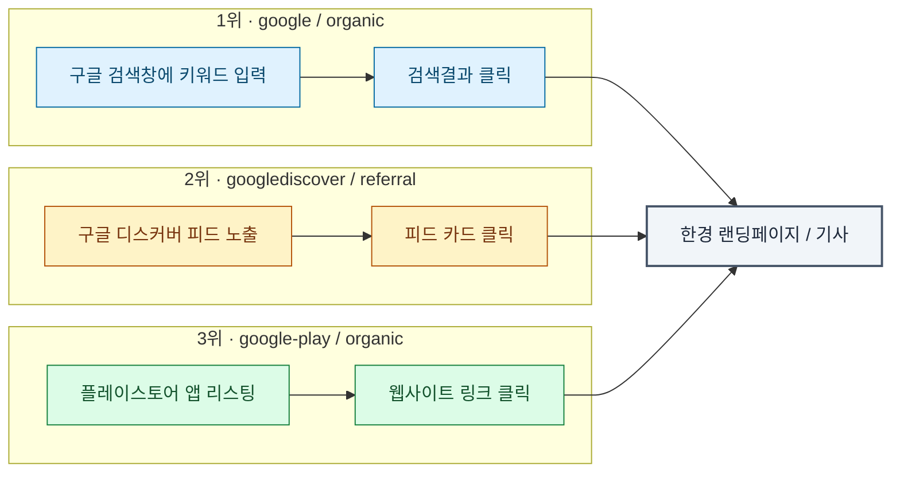

# 진입경로 User Flow 분석

- **Epic:** [HKGA-10] [Sprint1] 데이터 로그 분석 인사이트 도출
- **목적:** GA4 트래픽 데이터를 기반으로 채널별 진입경로(User Flow)를 분석하고, 랜딩페이지 개선을 위한 기회요소를 도출한다.
- **구성:** 채널별로 4명이 나눠 분석하며, 아래 목차의 하위 섹션으로 결과를 취합한다.

## 목차

1. 네이버 진입경로 분석 — 담당: Dolphin Black ([HKGA-52](https://hkuxui5.atlassian.net/browse/HKGA-52)) — *작성 예정*
2. LLM 진입경로 분석 — 담당: bean ([HKGA-53](https://hkuxui5.atlassian.net/browse/HKGA-53)) — *작성 예정*
3. [구글(Google) 진입경로 분석](#3-구글google-진입경로-분석) — 담당: 김민성 ([HKGA-54](https://hkuxui5.atlassian.net/browse/HKGA-54))
4. 유튜브 진입경로 분석 — 담당: Ahyoung ([HKGA-55](https://hkuxui5.atlassian.net/browse/HKGA-55)) — *작성 예정*

---

## 3. 구글(Google) 진입경로 분석

- **담당:** 김민성
- **기간:** 2026년 6~7월 (정확한 시작/종료일은 확인 필요)
- **데이터 출처:** GA4 Acquisition 리포트 (source/medium), GA4 사용자별 기기 리포트

### 3.1 진입경로 순위 (source / medium)

| 순위 | source / medium | 해석 |
| --- | --- | --- |
| 1 | google / organic | 정석적인 구글 검색결과 클릭. 실제 검색 발견 유입 |
| 2 | googlediscover / referral | 구글 디스커버 피드 추천 노출 후 클릭 (검색이 아닌 알고리즘 추천) |
| 3~4 | google-play / organic (2건) | 플레이스토어 앱 리스팅 경유 유입. 실제 앱스토어 링크인지 확인 필요 |
| 5~6 | accounts.google.com / referral (2건) | 구글 로그인(OAuth) 인증 리다이렉트. 신규 발견 유입 아님 — 2건인 이유 확인 필요 |
| 7 | gemini.google.com / referral | Gemini(AI 챗봇)가 답변에 링크를 인용해 발생한 클릭 |
| 8~9 | accounts.google.co.kr / referral (2건) | 위와 동일한 로그인 리다이렉트(국내 도메인) |
| 10 | google / (not set) | 미태깅 유입. 인앱브라우저/Discover 등에서 리퍼러 유실 추정 |
| 11 | trends.google.co.kr / referral | 구글 트렌드 페이지 경유 (이슈/속보 대응형 트래픽) |
| 12 | mail (Gmail 추정) / referral | 이메일(뉴스레터 등) 링크 클릭을 통한 재참여 트래픽 |

### 3.2 상위 3개 경로 Flow (Mermaid)

### 3.3 유입 기기 분석 — 모바일/웹 생태 확인

상위 진입경로 중 2위인 `googlediscover`는 구글 모바일 앱(Discover 피드)에서 주로 발생하는 경로라, 모바일 앱/웹 생태계 자체에 기회요소가 있을 것이라 보고 GA4 "사용자별 기기" 리포트로 플랫폼/기기 카테고리별 비중을 확인함.

**오피니언·아르떼** (전체 229,674)

| 플랫폼 / 기기 | 조회수 | 비중 |
| --- | --- | --- |
| web / mobile | 86,223 | 37.5% |
| web / desktop | 70,981 | 30.9% |
| Android / mobile | 52,548 | 22.9% |
| iOS / mobile | 14,817 | 6.5% |
| web / tablet | 2,763 | 1.2% |
| Android / tablet | 1,371 | 0.6% |
| iOS / tablet | 971 | 0.4% |

→ 모바일 카테고리 전체(web+Android+iOS mobile) **66.9%**, 데스크톱 **30.9%**

**글로벌마켓** (전체 678,542)

| 플랫폼 / 기기 | 조회수 | 비중 |
| --- | --- | --- |
| web / mobile | 338,773 | 49.9% |
| web / desktop | 230,166 | 33.9% |
| Android / mobile | 64,691 | 9.5% |
| iOS / mobile | 31,953 | 4.7% |
| web / tablet | 8,413 | 1.2% |
| Android / tablet | 2,443 | 0.4% |
| iOS / tablet | 2,099 | 0.3% |
| web / smart tv | 4 | 0.0% |

→ 앱(Android+iOS, mobile+tablet 전체) **14.9%**, 모바일 카테고리 전체 **64.2%**

**결론:** 두 섹션 모두 네이티브 앱보다 웹/모바일(브라우저) 유입이 압도적으로 많음. 특히 글로벌마켓은 앱 비중이 15%도 안 됨.

### 3.4 기회요소

1. **Google Discover 최적화 (즉각적 임팩트):** 이미 2위 규모이면서, 키워드 경쟁이 아니라 썸네일·제목·이미지 품질·구조화 데이터로 성과를 낼 수 있는 채널.
2. **Gemini(AI 인용) 채널 선점 (전략적 기회):** 볼륨은 작지만 프로젝트 주제(AI 인터랙티비티 개선)와 직접 연결되고, 아직 경쟁이 적어 먼저 최적화하면 선점 효과를 기대할 수 있음.
3. **모바일 웹 최적화:** Discover·Gemini 모두 모바일·음성 사용 비중이 높은 채널이고, 실제 기기 데이터에서도 앱이 아닌 모바일 웹 유입이 압도적으로 많음이 확인됨 → 최적화 타깃을 네이티브 앱이 아닌 모바일 웹 랜딩페이지(로딩 속도, 반응형 레이아웃, 음성검색 스니펫 대응)로 잡아야 함.

