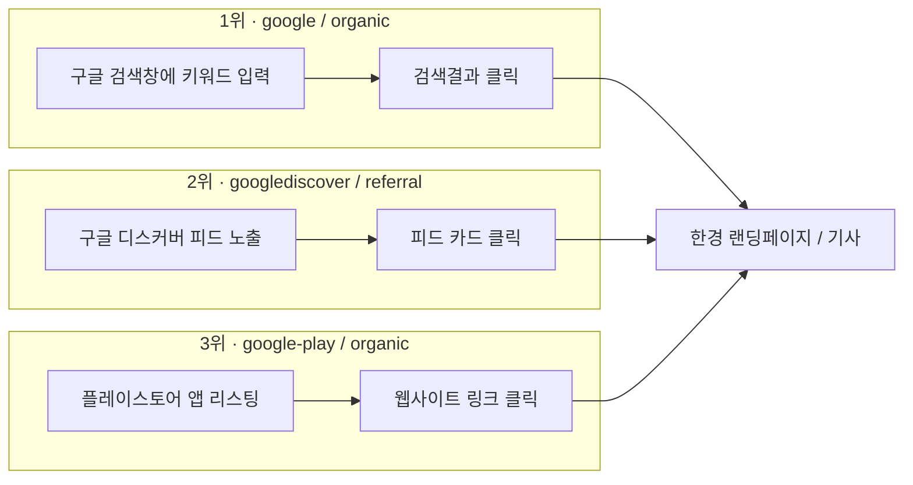

# 한국경제 채널별 유입경로 통합 분석 — 네이버 · 구글 · 유튜브 · LLM

3개의 개별 분석 문서(네이버, 구글, 유튜브)와 LLM 검색/챗봇 조사 결과를 하나로 통합해, 채널 간 유입 메커니즘의 성격 차이와 공통 기회요소를 정리한 문서입니다.

**통합 대상 원본 문서**

- 네이버(웹/앱) 기반 한국경제 뉴스페이지 유입 경로 정리 문서
- entry-path-flow-analysis.md — 3. 구글(Google) 진입경로 분석
- 한경 유튜브 전략 분석: 기회요소 인사이트 및 가설 검증 설계
- 한국경제*AI검색*유저플로우.md (Claude / Chrome AI 모드 / ChatGPT / Gemini / Copilot)

---

## 0. 채널별 데이터 성격 차이 (주의사항)

네 채널의 데이터는 측정 기준·기간·단위가 서로 달라 절대값 비교보다 **구조적 패턴 비교**에 초점을 맞춰야 합니다.

| 채널   | 데이터 기간                | 측정 단위                                      | 데이터 출처                                |
| ------ | -------------------------- | ---------------------------------------------- | ------------------------------------------ |
| 네이버 | 2026.6.6~7.5 (1개월)       | 세션 소스/매체별 조회수                        | GA4                                        |
| 구글   | 2026년 6~7월               | 세션 소스/매체별 조회수 (오피니언·아르떼 섹션) | GA4                                        |
| 유튜브 | 채널 누적 (2024.11~2026.7) | 구독자 수, 조회수                              | 유튜브 스튜디오 + 업계 벤치마크(외부 인용) |
| LLM    | 최근 1개월                 | 세션 소스/매체(ai-assistant, referral)         | GA4                                        |

---

## 1. 채널별 핵심 지표 한눈에 보기

| 채널                   | 유입 성격                                                        | 규모감                                                                                        | 성장 방향성                                                                                   |
| ---------------------- | ---------------------------------------------------------------- | --------------------------------------------------------------------------------------------- | --------------------------------------------------------------------------------------------- |
| **네이버**             | 목적형 검색(60%+) + PC 뉴스스탠드 고정 독자                      | 오피니언 섹션 기준 최상위권 (naver/organic 5,536 등)                                          | 정체·완만한 감소 예상 (강사 피드백: 네이버 뉴스 소비자 자체가 줄고 있음)                      |
| **구글**               | 정석 검색(1위) + Discover 알고리즘 추천(2위) + Gemini 인용(신규) | google/organic이 오피니언·아르떼 전체 트래픽의 15.0%(8,611건)로 전 채널 통틀어 최대 단일 채널 | Discover·Gemini 등 비검색형 유입이 새로 부상 중                                               |
| **유튜브**             | 구독 기반 습관적 시청 (라이브, 정기 세그먼트)                    | 7개 채널 합산 구독자 약 390만 명, 코리아마켓 1년 2개월 만에 +23만 순증                        | 국내 유튜브 뉴스 이용률(49%)이 세계 평균(31%) 상회, 50대 이상 이용 급증(+9%p) — 구조적 성장기 |
| **LLM (AI 검색·챗봇)** | AI 답변 내 출처 인용을 통한 유입                                 | 5개 플랫폼 합산 227건(전체의 0.4% 미만) — 절대 규모는 가장 작음                               | 아직 초기 단계지만 GEO 경쟁이 적어 선점 여지가 가장 큼                                        |

**핵심 요약**: 현재는 **네이버·구글이 규모를, 유튜브가 잠재 오디언스를, LLM이 미래 성장성을** 각각 대표하는 구조입니다.

---

## 2. 채널별 상세 분석

### 2.1 네이버

**유입 경로 Top 5 (세션 소스/매체)**

| 순위 | 세션 소스/매체                 | 조회수 | 성격                    |
| ---- | ------------------------------ | ------ | ----------------------- |
| 1    | naver / organic                | 5,536  | 통합검색 자연 유입      |
| 2    | m.search.naver.com / referral  | 4,206  | 모바일 검색결과 유입    |
| 3    | newsstand.naver.com / referral | 2,990  | PC 뉴스스탠드 고정 독자 |
| 4    | naverapp / referral            | 985    | 앱 내부 브라우저        |
| 5    | naver.com / referral           | 561    | 기타 네이버 도메인      |

**핵심 인사이트**

- **목적형 검색의 절대 우위(약 62.1%)**: naver/organic + m.search.naver.com 합산 9,742회. 특정 필진·칼럼 제목·경제 키워드를 직접 검색해 찾아오는 비중이 압도적 → 콘텐츠 깊이와 SEO가 방어선.
- **PC 뉴스스탠드의 건재함**: 모바일 시대에도 2,990회로 3위. 직장인·비즈니스맨 중심 고정 독자층의 락인(Lock-in) 효과.
- **알고리즘 추천 지면의 한계**: media.naver.com/n.news.naver.com(647건 합산)은 하위권. 오피니언·칼럼은 정치/사회 속보 중심의 네이버 추천 피드에 걸리기 어려움.
- **UGC(블로그·카페)를 통한 2차 확산**: 158건 규모지만, 재테크 블로거·투자 카페에서 "신뢰성 있는 근거 자료"로 인용되는 지식 자산으로서의 가치를 보여줌.

**강사 피드백 (핵심 시사점)**

> 순위 3위 이하는 숫자가 작아 큰 의미 없음. 네이버 같은 플랫폼의 뉴스 소비자 수 자체는 줄고 있지만, 뉴스에 대한 관심·소비는 오히려 늘었을 수 있음. 자잘한 지면 최적화보다 **서비스 제공 방식 자체(포맷)**를 크게 재설계해야 함. 모바일 웹이지만 앱처럼 움직이는 방향을 권장.

또한 구글은 네이버 뉴스페이지를 거치지 않고 원문 기사로 바로 이동하며, ChatGPT는 RAG 형식으로 여러 뉴스를 인링크/아웃링크 혼재로 보여주는 반면 **Claude는 아웃링크 중심**이라는 관찰이 함께 기록됨 — 이는 아래 4장 LLM 분석과 정확히 일치합니다.

---

### 2.2 구글

**진입경로 순위 (source/medium)**

| 순위 | source/medium                  | 해석                                   |
| ---- | ------------------------------ | -------------------------------------- |
| 1    | google / organic               | 정석 검색결과 클릭                     |
| 2    | googlediscover / referral      | Discover 피드 알고리즘 추천            |
| 3~4  | google-play / organic          | 플레이스토어 경유                      |
| 7    | gemini.google.com / referral   | Gemini 답변 내 링크 인용               |
| 10   | google / (not set)             | 리퍼러 유실 (인앱브라우저·Discover 등) |
| 11   | trends.google.co.kr / referral | 트렌드 페이지 경유                     |

**기기 분석 — 모바일 웹 우세**
오피니언·아르떼(66.9% 모바일), 글로벌마켓(64.2% 모바일) 모두 네이티브 앱보다 **모바일 웹(브라우저)** 유입이 압도적. 글로벌마켓은 앱 비중이 15%도 안 됨.

**기회요소**

1. Google Discover 최적화 — 키워드 경쟁이 아닌 썸네일·제목·이미지·구조화 데이터로 성과를 낼 수 있는 즉각적 채널.
2. Gemini(AI 인용) 채널 선점 — 볼륨은 작지만 경쟁이 적어 선점 효과 기대.
3. 모바일 웹 최적화 — 네이티브 앱이 아닌 모바일 웹 랜딩페이지(로딩 속도, 반응형, 음성검색 스니펫)에 투자 집중.

---

### 2.3 유튜브

**기존 트래픽 풀 (7개 채널 합산 구독자 약 390만)**

| 채널            | 구독자 | 습관적 접점                                                         |
| --------------- | ------ | ------------------------------------------------------------------- |
| 한국경제TV      | 138만  | 실시간 증시 중계 상시 시청                                          |
| 한경 글로벌마켓 | 76만   | 오전 6시반대 라이브(월스트리트나우)                                 |
| 한경 코리아마켓 | 73.1만 | 출퇴근 시간대 하루 2회 라이브(모닝루틴) — 1년 2개월 만에 +23만 순증 |
| 집코노미        | 62.7만 | 흥청망청·집터뷰 등 정기 세그먼트                                    |
| 한국경제TV뉴스  | 22.2만 | 속보 브리핑                                                         |
| 한경arteTV      | 11.6만 | 문화예술 콘텐츠 (투자와 무관, 교차유입 설계 없음)                   |
| 한국경제신문    | 5.96만 | 심층 분석(송종현의 머니톡 등)                                       |

**핵심 인사이트**

- **구조적 타이밍 기회**: 한국은 유튜브 뉴스 이용률(49%)이 세계 평균(31%)을 크게 상회하는 이례적 시장. 지면 축소(-5.0%)와 디지털 성장(+4.9%)이 교차하는 시점.
- **연령 역설**: 2030세대는 틱톡·인스타로 이탈 중이나, 50대 이상 유튜브 이용률은 오히려 +9%p 증가 — 한경의 전통 핵심 독자층과 정확히 겹침.
- **퍼스널리티 IP화**: 18~24세는 브랜드(39%)보다 개별 기자(51%)에 더 반응. 한경은 이미 월스트리트나우(김현석)·글로벌마켓나우(조재길)·한상춘의 국제경제 등 진행자 개인 브랜드를 다수 보유.
- **프리미엄9 무료 티저 구조 실증**: 월 1회 무료 공개 영상이 수십만 조회수 기록. 라이브(무료)→다시보기(유료) 구조가 실제로 작동 중(희소성/손실회피 설계).
- **이탈 지점**: 인앱 브라우저 로딩 지연, 페이월/로그인 팝업의 노출 타이밍이 주요 이탈 요인.

**목표 재정의**: 유튜브 구독자를 늘리는 것이 아니라, **이미 확보된 390만 구독자 풀을 웹/앱으로 전환**하는 UX/UI 설계 문제로 좁혀서 접근.

**전환 트리거 지점 (터치포인트별 개선 방향)**

- 인앱 브라우저 랜딩: 3초 내 핵심 정보 노출 + 페이월 팝업은 일부 소비 후 노출(즉시 노출 시 반발/이탈 유발 — Reactance Theory)
- 고정 댓글/설명란: 단순 URL 나열이 아닌 "원본 데이터 보기"류 구체적 CTA로 전환
- 최종화면(End Screen)·카드: 영상 주제와 1:1 매칭되는 기사로 연결
- 진행자 비주얼 일관성: 영상 속 진행자 얼굴·이름을 랜딩 기사에도 동일 노출(신뢰 전이 효과)
- 앱 딥링크: 설치 유도보다 모바일 웹 우선 노출 후 설치 제안

**GEO(생성엔진최적화) 기회**: ChatGPT·Perplexity 등 AI 검색엔진이 새 유입 관문으로 부상 중이나, 국내 언론사 다수가 아직 스키마 마크업 등 기술 대응을 안 한 상태 — 경쟁이 적은 블루오션.

---

### 2.4 LLM (AI 검색·챗봇)

**플랫폼별 관찰 및 실측 데이터 요약**

| 플랫폼                   | 출처 표시                       | 필요한 사용자 행동        | 한국경제 도달 | 실측 유입(1개월)                               |
| ------------------------ | ------------------------------- | ------------------------- | ------------- | ---------------------------------------------- |
| Claude                   | 표시함(키워드별 노출 확률 상이) | 없음(노출 시 클릭만)      | 조건부 가능   | 7건 (0.012%)                                   |
| Chrome AI 모드           | 브랜드명 검색 시에만 상단 노출  | 정확한 키워드 입력 + 클릭 | 조건부 가능   | 분리 불가(google/organic 8,611건에 혼재)       |
| ChatGPT                  | 표시되나 숨겨짐                 | 소스 아이콘 클릭 + 스크롤 | 조건부 가능   | 185건 (0.323%) — 5개 중 1위                    |
| Gemini                   | 없음                            | 없음                      | 불가          | 35건 (0.061%) — 테스트 결과보다 실제 유입 많음 |
| Microsoft Edge (Copilot) | 없음(구글 뉴스 위주)            | 없음                      | 불가          | 1건 (0.002%)                                   |

**핵심 인사이트**

- 정성적 테스트(도달 난이도)와 정량 데이터(실제 유입량) 순위가 완전히 일치하지 않음. 특히 Gemini는 테스트상 "도달 불가"였지만 실제로는 Claude보다 5배 많은 유입 발생 — Google 검색 색인 품질에 따라 예외적으로 노출되는 구간이 존재함을 시사.
- ChatGPT는 클릭+스크롤이라는 허들에도 불구하고 절대 유입량 1위 — 경로 자체는 열려 있고 노출 위치 개선의 문제.
- Copilot과 Chrome AI 모드는 정성·정량 분석이 방향성 면에서 일치(거의 도달 불가/구분 불가).

전체 채널 대비 LLM의 절대 볼륨은 미미하지만(전체의 0.4% 미만), 유튜브 분석의 "GEO 블루오션" 인사이트와 정확히 맞물리는 지점입니다.

---

## 3. 채널 간 비교 분석

### 3.1 유입 메커니즘 성격 비교

| 구분             | 네이버                       | 구글                              | 유튜브                           | LLM                             |
| ---------------- | ---------------------------- | --------------------------------- | -------------------------------- | ------------------------------- |
| 핵심 동인        | 목적형 검색 + 고정 지면 습관 | 검색 + 알고리즘 추천(Discover)    | 구독 기반 습관적 시청            | AI 답변 내 출처 인용            |
| 유저의 능동성    | 중간(키워드 검색)            | 낮음(Discover는 수동 피드)        | 낮음(루틴화된 소비)              | 낮음~중간(클릭/스크롤 필요)     |
| 콘텐츠 발견 방식 | 검색엔진 인덱스              | 검색엔진 + 추천 알고리즘          | 채널 구독·편성 루틴              | LLM의 웹 검색/색인 참조         |
| 최적화 레버      | SEO, 콘텐츠 깊이             | SEO + Discover 최적화(썸네일 등)  | 콘텐츠 편성 + 전환 UX            | GEO(구조화 데이터, 크롤러 허용) |
| 현재 규모        | 큼                           | 가장 큼(단일 채널 기준)           | 잠재 오디언스 최대(390만 구독자) | 가장 작음                       |
| 성장 방향        | 정체·완만한 감소             | Discover·Gemini 등 신규 채널 부상 | 구조적 성장기(뉴스 소비 이동)    | 초기 단계, 경쟁 적음            |

### 3.2 공통적으로 발견되는 병목

1. **"뉴스 지면 추천"의 한계**: 네이버(media.naver.com), 유튜브(오피니언·문화 콘텐츠) 모두 일반 알고리즘 추천 피드에는 무거운 오피니언·칼럼 콘텐츠가 걸리기 어렵다는 공통 한계 확인.
2. **랜딩 후 이탈 지점의 유사성**: 유튜브 인앱 브라우저의 로딩 지연·페이월 팝업 이슈는, LLM 채널에서 관찰된 "클릭 이후 실제 도달까지의 허들"(ChatGPT 스크롤 등)과 본질적으로 같은 문제 — **원본 페이지 도달 이후의 첫 화면 경험**이 전환율을 좌우.
3. **브랜드 표기 민감도**: 네이버·구글은 필진명·칼럼 제목 등 구체적 키워드에 반응하는 반면, Chrome AI 모드는 "한국경제뉴스"라는 정확한 브랜드명에만 반응 — 채널을 막론하고 **브랜드 엔터티(다양한 표기의 동일 개체 인식)** 정비가 공통 필요.
4. **AI 기반 채널의 구조적 유사성**: Gemini(구글 생태계)·Chrome AI 모드·Copilot(Bing 생태계) 모두 결국 각 사의 검색 인덱스 품질에 종속됨 — 즉 LLM 최적화는 결국 전통적 SEO(구글) 및 Bing SEO의 연장선.

### 3.3 채널별 우선순위 판단 근거

- **네이버**: 이미 성숙한 채널로 자잘한 지면 최적화의 한계 도달 → 포맷 자체의 재설계(모바일 웹의 앱化) 필요.
- **구글**: 검색은 이미 강하나, Discover·Gemini 등 비검색형 신규 채널이 상대적으로 저비용 고효율 기회.
- **유튜브**: 신규 콘텐츠 제작보다 **이미 존재하는 390만 구독자 트래픽의 전환 설계**가 가장 저비용·고효율. 습관적 시청 루틴이 이미 존재하므로 전환 트리거만 삽입하면 되는 구조.
- **LLM**: 절대 볼륨은 작지만 경쟁자 다수가 아직 대응하지 않은 초기 시장 — 지금 선점 시 향후 AI 검색 비중 확대에 따른 복리 효과 기대.

---

## 4. 통합 기회요소 (Cross-Channel Opportunity Factors)

### 4.1 전 채널 공통 기회요소

1. **GEO/AIEO(생성엔진최적화) 조기 대응** — 구조화 데이터(NewsArticle, Organization, Author schema), AI 크롤러(GPTBot, ClaudeBot, Google-Extended, Bingbot) 허용 여부 점검. 유튜브·LLM 분석 모두 동일하게 "경쟁 적은 블루오션"으로 지목.
2. **브랜드 엔터티 통합 관리** — "한국경제", "한국경제뉴스", "한경", "hankyung" 등 다양한 표기가 동일 개체로 인식되도록 지식그래프·구조화 데이터 정비 (Chrome AI 모드의 키워드 민감도 문제 직접 해결).
3. **랜딩 후 첫 화면 UX 통일 개선** — 유튜브 인앱 브라우저 로딩 지연, LLM 경유 클릭 후 이탈 등 "도달 이후" 병목을 공통 과제로 묶어 개선. 페이월/로그인 팝업은 즉시 노출이 아닌 콘텐츠 일부 소비 후 노출(Reactance Theory 대응).
4. **모바일 웹 우선 설계** — 구글(모바일 웹 66.9%), 네이버(모바일 앱처럼 동작하는 웹 권장) 모두 네이티브 앱보다 모바일 웹 최적화가 우선순위임을 시사.
5. **측정 체계 정비** — GA4에서 AI 어시스턴트 유입(ai-assistant 매체), Chrome AI 모드처럼 아직 분리되지 않는 유입을 구분 추적할 수 있도록 커스텀 정의/UTM 표준화(`utm_source=youtube`, `utm_campaign=news_transfer` 등 유튜브 분석에서 제안된 규칙을 전 채널로 확장).
6. **퍼스널리티(개인 브랜드) 자산 재활용** — 유튜브에서 이미 검증된 진행자 신뢰(김현석·전형진·임현우 등)를 랜딩 기사·뉴스레터·LLM 인용 최적화(저자 schema)에도 일관되게 노출해 신뢰 전이 효과 확대.

### 4.2 채널별 개별 기회요소 요약

| 채널   | 우선 기회요소                                                                                                     |
| ------ | ----------------------------------------------------------------------------------------------------------------- |
| 네이버 | 지면 최적화보다 서비스 포맷 재설계(모바일 웹의 앱化), MY뉴스·경제 테마판 노출을 위한 체류시간 증대 UI             |
| 구글   | Google Discover 최적화(썸네일·구조화 데이터), 모바일 웹 랜딩페이지 속도 개선                                      |
| 유튜브 | 고정 댓글 CTA 구체화(즉시 실행 가능), 인앱 브라우저 랜딩 경량화, 페이월 팝업 타이밍 조정, 최종화면·카드 매칭      |
| LLM    | AI 크롤러 허용 점검, 구조화 데이터/llms.txt 도입, Bing·MSN 파트너십(Copilot 대응), Gemini용 Google 색인 품질 개선 |

---

## 5. 우선순위 제언 종합

**즉시 실행 가능 (Quick Win, 별도 콘텐츠 제작 불요)**

- 유튜브 고정 댓글/설명란 CTA 문구 개선
- 로봇 크롤러(robots.txt) 허용 여부 점검 — 전 채널 공통, 리소스 소모 없이 확인 가능
- 페이월/로그인 팝업 노출 타이밍 조정 A/B 테스트

**중기 과제 (기존 자산 확장)**

- 유튜브 최종화면·카드 매칭, 진행자 비주얼 일관성 UI
- Google Discover용 썸네일·구조화 데이터 정비
- 브랜드 엔터티 통합(지식그래프 정비)

**탐색적 파일럿 (국내 사례 적음, 소규모 실행 후 확장)**

- GEO 마크업 적용 후 AI 검색엔진 인용 빈도 비교 실험
- llms.txt 도입 테스트
- 숏폼 자동화 제작 장치(강사 제언: 대응 이미지 생성 + 음성 지원 자동화)

**측정 선행 조건**

- 모든 가설 검증과 우선순위 재조정의 전제는 GA4/UTM 데이터의 정합성 확보. 특히 Chrome AI 모드처럼 아직 구분되지 않는 유입을 분리 측정할 수 있는 태깅 체계 정비가 다른 모든 개선의 선행 과제.
